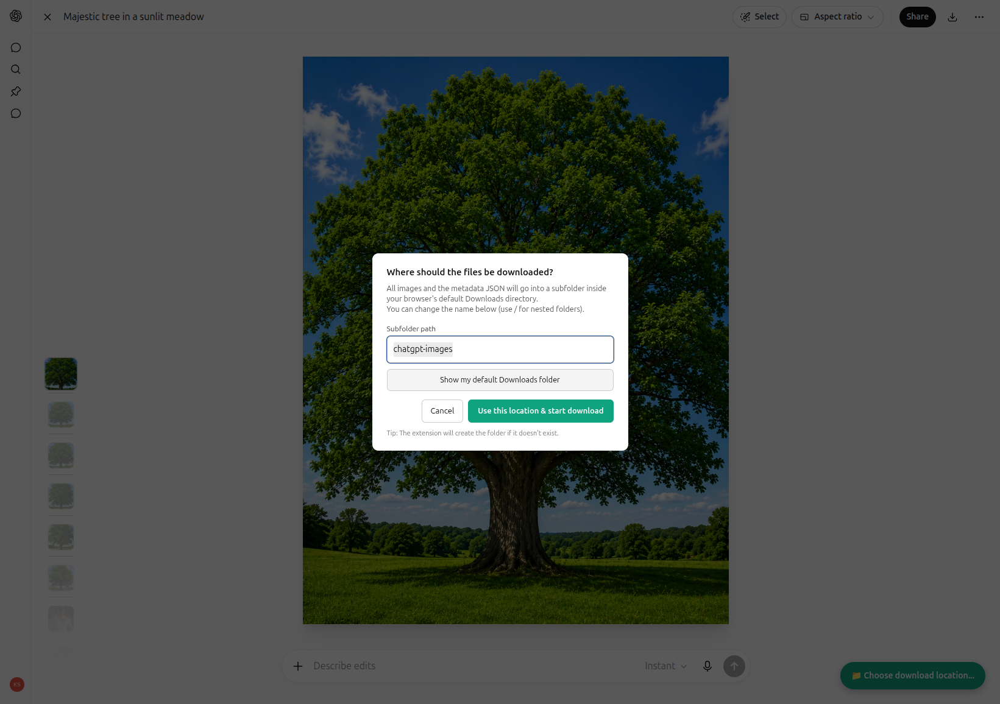
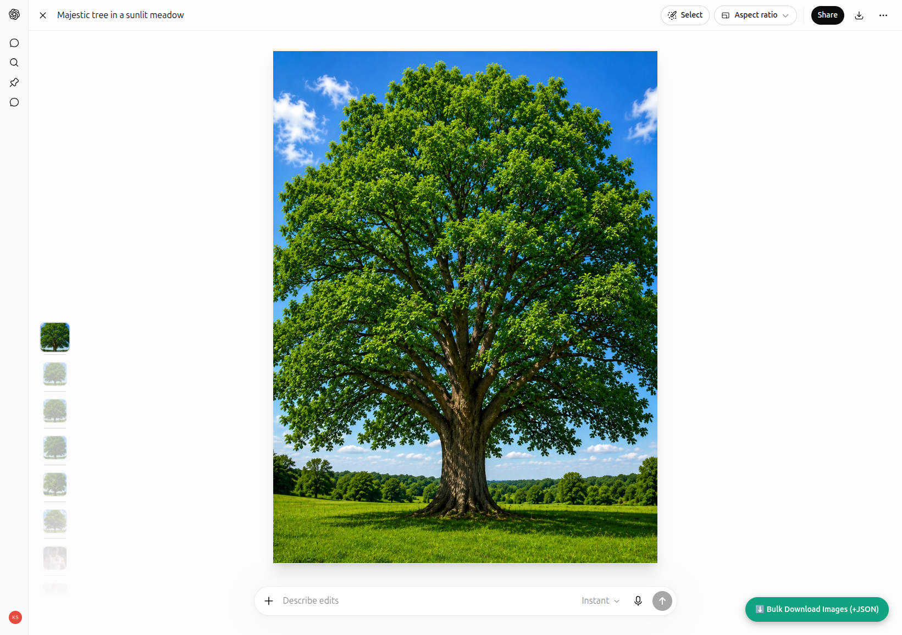
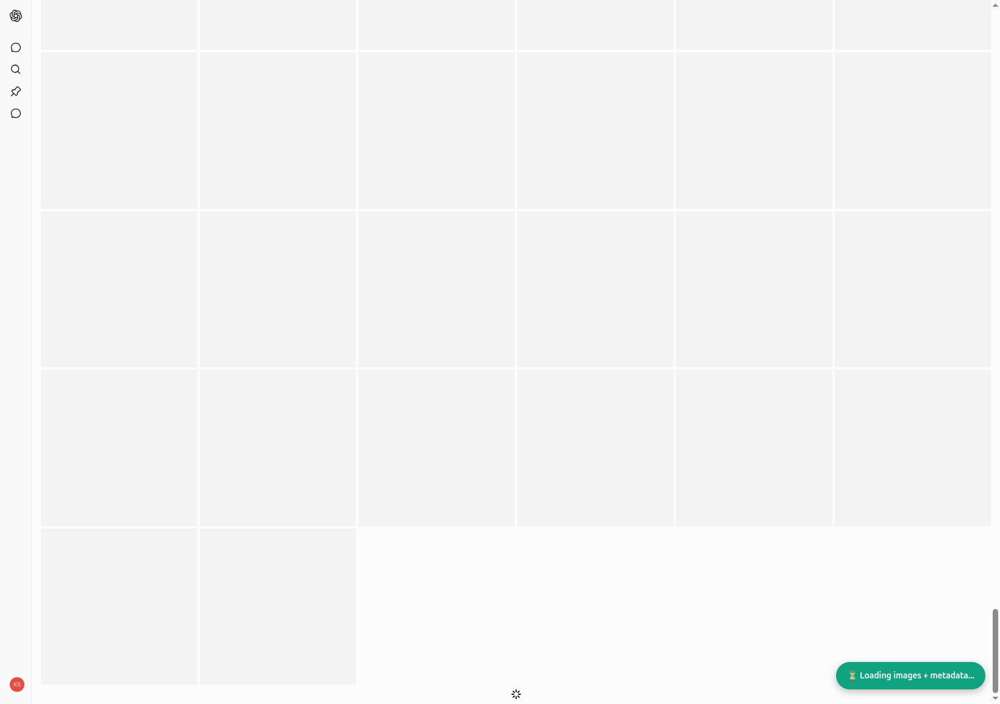
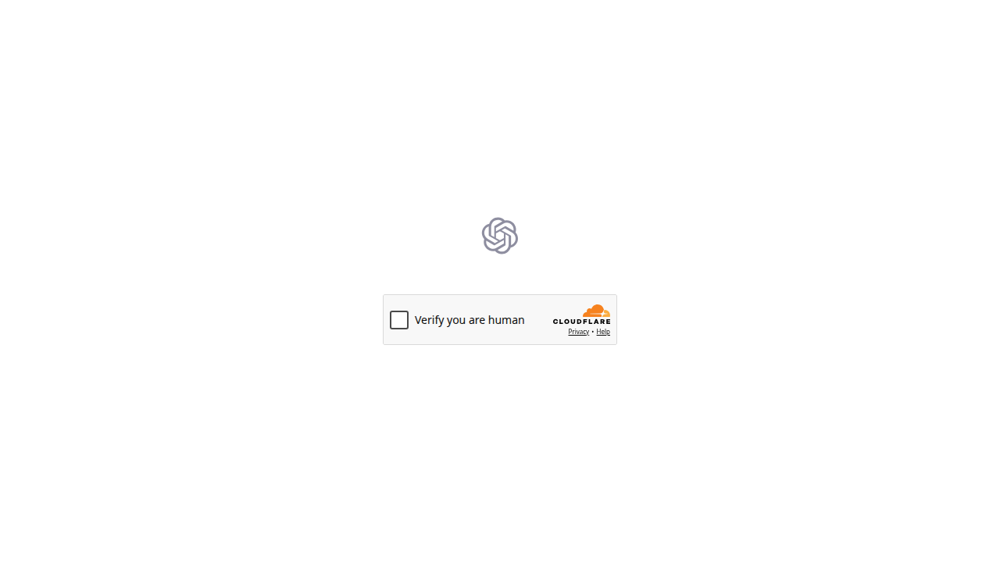
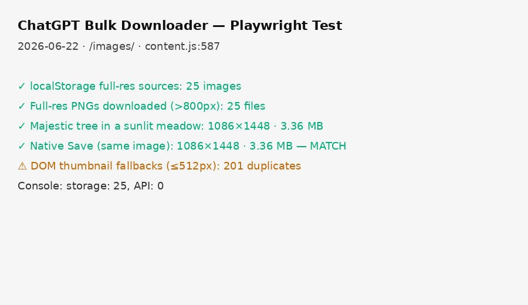

# ChatGPT Bulk Downloader

[](https://opensource.org/licenses/MIT)
[](https://developer.chrome.com/docs/extensions/mv3/)

One-click Chrome extension to **bulk download images** from any ChatGPT Library folder or the dedicated `/images/` gallery, **plus a rich metadata JSON** containing conversation dates, update times, and the full folder/directory structure.

No more clicking individual "Download" buttons or selecting in batches. Everything stays in your browser using your existing ChatGPT session.

## Features

- **Bulk image download** from:
  - Library folders (`/library/d/...`)
  - Images gallery (`/images/`)
- **Metadata JSON export** (the key new feature):
  - Conversation `create_time` / `update_time`
  - Folder & directory structure (via the same `files/library` APIs the site uses)
  - Image nodes with their metadata
  - Full recent conversations list
- Before any downloads, you are required to confirm the exact subfolder name in a modal (with a button to open your default Downloads folder for reference). Everything lands inside that subfolder under your normal browser Downloads location.
- Smart name extraction (preserves original filenames like `vlcsnap-...png`, `image(1289).png` when available; falls back gracefully on the gallery)
- Handles lazy-loaded / virtualized grids with aggressive scrolling
- Client-side only — no servers, no data exfiltration
- Works with both the native `chrome.downloads` API (subfolders) and fallback

## Installation

### As Unpacked Extension (recommended for now)

1. Clone this repo or download the source ZIP.
2. Open Chrome and go to `chrome://extensions/`
3. Enable **Developer mode** (top right)
4. Click **Load unpacked**
5. Select the `chatgpt-bulk-downloader` folder
6. Pin the extension if desired (it shows no toolbar icon — it only injects on `chatgpt.com`)

### Chrome Web Store

Not published there yet. Install from source as described above.

## Usage

1. Go to a ChatGPT Library folder, for example:
   - `https://chatgpt.com/library/d/6a37b386ee388191bc2b11881e014622?tab=images`
   - Or simply `https://chatgpt.com/images/`
2. If you see the Cloudflare "Just a moment..." challenge, move your mouse, scroll naturally, or click around in the tab until the real content appears (this is normal for automation detection).
3. (Optional but recommended) Scroll down the grid to load more images.
4. Click the green floating button in the bottom-right:
   - `⬇️ Bulk Download Folder (+JSON)` on library pages
   - `⬇️ Bulk Download Images (+JSON)` on the gallery
   - A modal will immediately appear requiring you to confirm or edit the destination subfolder name. Use the "Show my default Downloads folder" button to open your actual Downloads directory so you can decide on a good location (e.g. "chatgpt-exports/2024-june"). Downloads will not start until you confirm.
5. The extension will:
   - Scroll aggressively to load lazy/virtualized images
   - Collect all qualifying images from the OpenAI CDN
   - Download a `*-metadata.json` file with full folder + conversation timing data
   - Trigger the image downloads (staggered to be browser-friendly)
6. After confirming, allow the Chrome "multiple downloads" prompt if it appears. All files will go into the subfolder you chose (under your normal Downloads directory). Check there (the button shows the path). The metadata JSON is always written even if some images fail.

You can repeat the process on different folders — files with the same name will get `(1)`, `(2)`, etc. (all under the same configurable subfolder).

## Screenshots

These are real UI captures from testing. They use generic example images and contain no personal data.

### Destination chooser

Before any downloads start, you must confirm where files go. The extension creates a subfolder under your browser's default Downloads directory.



### Bulk download button

On library folders and the `/images/` gallery, a green floating button appears in the bottom-right corner.



### Download in progress

While scrolling, collecting images, and fetching metadata, the button shows a loading state.



### Cloudflare challenge

If you land on a "Verify you are human" screen, interact with the page normally (move the mouse, scroll, click) until the real ChatGPT UI loads. The extension only runs on the live site.



### Full-resolution downloads

Images are pulled at full resolution (not 512×512 grid thumbnails). This test summary compares extension downloads against ChatGPT's native Save button.



## The Metadata JSON

This is the main reason many people wanted this tool.

When you trigger a bulk download on a library folder, you also get a file like:

- `chatgpt-folder-6a37b386-metadata.json` (the prefix "chatgpt-folder-..." comes from the code; the containing folder is <DOWNLOAD_FOLDER>/ )

It contains (raw from ChatGPT's own APIs):

- `directoryPath` — info about the current folder
- `nodes` — the full file/folder tree under that directory
- `imageNodes` — just the images (with sizes, original names, timestamps if available)
- `conversations` — recent conversations with `create_time`, `update_time`, titles, etc.
- `recentUploadedImages` (on the `/images/` gallery)
- Context (URL, timestamp, folder ID)

This lets you reconstruct exactly when conversations happened and how the folders are organized — perfect for archiving, searching, or building your own tools on top of the data.

## Privacy & Security

- **Everything runs in your browser** on `chatgpt.com` pages only.
- The extension only uses the same authenticated API endpoints that the ChatGPT web UI already calls (`/backend-api/files/library/...`, `/backend-api/conversations`, etc.).
- No external servers. No telemetry. No analytics.
- Your images and metadata never leave your machine except for the normal download to your local `Downloads` folder.
- Source code is fully open — audit it yourself.

## Development

```bash
git clone https://github.com/kairin/chatgpt-bulk-downloader.git
cd chatgpt-bulk-downloader
# Edit manifest.json + content.js
# Then Load unpacked in chrome://extensions/
```

### Updating the extension after changes

Just edit the files and click the **reload** icon on the extension card in `chrome://extensions/`.

### Building a .zip for distribution

You can manually zip the folder (excluding `.git`, `node_modules`, etc.) or use any Chrome extension packager.

## Roadmap / Ideas

- [ ] Publish to Chrome Web Store
- [ ] Add a small options page (choose target folder name, include full conversation text, etc.)
- [ ] Optional ZIP export of a whole folder + metadata
- [ ] Better icon set + store listing assets
- [ ] Support for more ChatGPT "projects" / custom folders

## Project status

This extension is released **as-is** under the MIT license. You may use, fork, and modify it freely.

There is **no support**: no issue triage, no pull request reviews, and no guarantee of updates or replies. ChatGPT's UI and APIs can change at any time and break functionality without notice.

## License

MIT — see [LICENSE](LICENSE).

## Credits

Built iteratively with the help of AI tooling while solving real pain around bulk-exporting ChatGPT libraries and generated images.

---

**Disclaimer**: Unofficial tool, not affiliated with OpenAI. Use at your own risk.